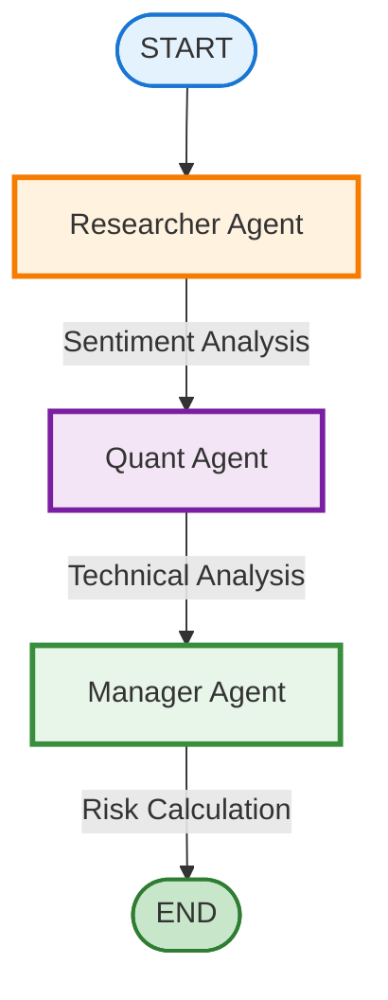

# Multi-Agent Trading Assistant - Workflow

## Agent Collaboration Flow

## Process Description

1. **START**: User provides a ticker symbol (e.g., AAPL, TSLA, MSFT)
2. **Researcher Agent**: Analyzes market sentiment, news, and analyst recommendations
3. **Quant Agent**: Performs technical analysis with RSI, moving averages, and chart patterns
4. **Manager Agent**: Consolidates findings, calculates risk using 2% rule, and generates final recommendation
5. **END**: Complete trade setup with entry/exit points and position sizing

## Agent Details

### Researcher Agent (Orange)
- Market sentiment analysis
- News aggregation
- Social media trends
- Analyst ratings

### Quant Agent (Purple)
- RSI (Relative Strength Index)
- Moving averages (50-day, 200-day)
- Support/resistance levels
- Chart pattern recognition

### Manager Agent (Green)
- Consolidates all findings
- Calls risk calculator tool
- 2% risk rule application
- Position sizing calculation
- Final recommendation
